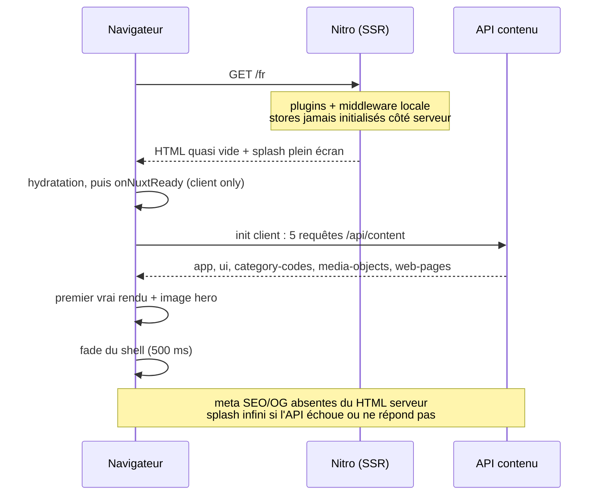
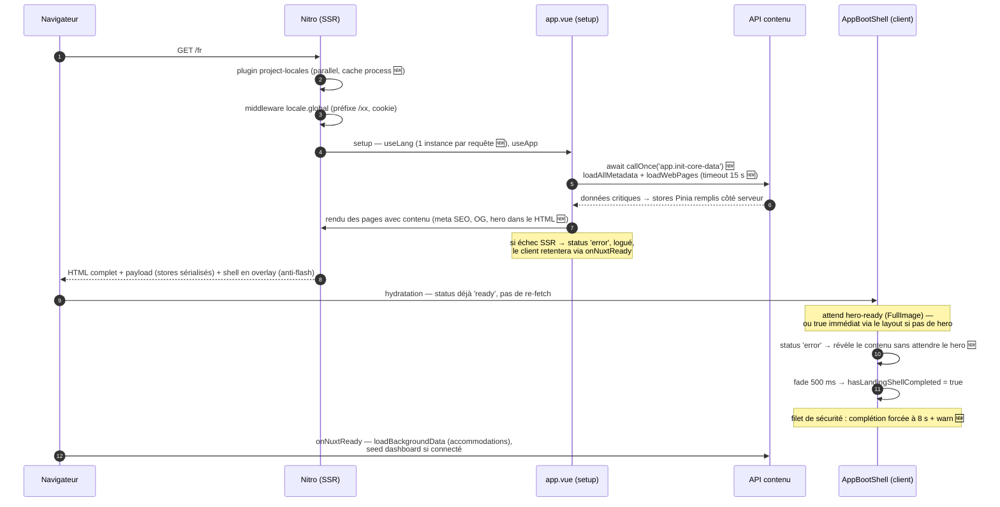

# Séquence de boot — du GET initial au retrait du AppBootShell

> Revue de code passe 1 — 2026-07-04
> Périmètre : `nuxt.config.ts`, plugins, middlewares globaux, `app.vue`, `AppBootShell.vue`
> Version visuelle : artifact « Boot Showcase Immobilier — séquence avant / après correctifs »

Légende : **[SSR]** serveur Nitro · **[CLIENT]** navigateur · **[API]** `/api/content` · 🆕 correctif du 2026-07-04

---

## Avant correctifs — un boot SPA masqué par un splash



Version texte :

1. **[SSR]** `GET /fr` — plugin `project-locales` (bloquant), middleware `locale.global` (préfixe `/xx`).
2. **[SSR]** Rendu des pages avec des **stores vides** — aucun appel serveur à `initCoreData()` (le commentaire d'`app.vue` référençait un plugin inexistant).
   ⚠️ HTML servi quasi vide : pas de contenu, pas de meta description, pas d'Open Graph.
3. **[CLIENT]** Hydratation puis `onNuxtReady` — le splash (`AppBootShell`) couvre l'écran.
4. **[CLIENT → API]** Init cœur : 5 requêtes (`app`, `ui/accommodation`, `category-code`, `media-object` — préchargement d'images assumé —, `web-pages`), sans timeout.
5. **[CLIENT]** Premier vrai rendu + image hero + fade 500 ms.
   ⚠️ Si l'init échoue ou reste suspendue : **splash infini**, site entièrement masqué.

---

## Après correctifs — init SSR, payload hydraté, shell borné



Version texte :

1. **[SSR]** `GET /fr` — `project-locales` en `parallel: true` 🆕 (cache process conservé), `locale.global` inchangé.
2. **[SSR]** Setup `app.vue` — `useLang()` : une instance **par requête** (WeakMap + effectScope) 🆕, fin de la fuite cross-requêtes de `createSharedComposable`.
3. **[SSR → API]** `await callOnce('app.init-core-data')` 🆕 — métadonnées + web-pages chargées pendant le rendu, timeout 15 s par requête 🆕. Échec → statut `error` logué, retry client.
   ✅ Stores remplis côté serveur : HTML complet (contenu, meta SEO, OG, markup hero), payload sérialisé, zéro re-fetch client.
4. **[CLIENT]** Hydratation — statut déjà `ready` ; le shell reste en overlay jusqu'au signal `hero-ready` (posé à `true` par le layout si la page n'a pas de hero).
5. **[CLIENT]** Retrait du shell — fade 500 ms puis démontage. `error` → révélation immédiate 🆕 ; filet de sécurité à 8 s avec `logger.warn` 🆕 (erreurs loguées aussi en production 🆕).
6. **[CLIENT → API]** `onNuxtReady` — retry éventuel de l'init, puis `loadBackgroundData()` (accommodations) et seed du hero dashboard (connectés uniquement).

---

## Correctifs associés

| Finding                       | Fichier(s)                                                                                         | Correctif                                                                 |
| ----------------------------- | -------------------------------------------------------------------------------------------------- | ------------------------------------------------------------------------- |
| 1. Pas d'init SSR             | `app/app.vue`                                                                                      | `await callOnce('app.init-core-data')` en setup                           |
| 2. Erreurs invisibles en prod | `app/composables/useLogger.ts`, `app/app.vue`                                                      | `error`/`fatal` émis en prod ; `onErrorCaptured` ne retourne plus `false` |
| 3. Fuite SSR `useLang`        | `app/composables/useLang.ts`                                                                       | instance par app Nuxt (WeakMap + effectScope détaché)                     |
| 4. Splash infini              | `app/composables/useApp.ts`, `app/components/AppBootShell.vue`, `app/utils/loadContentResource.ts` | `error` → shell masqué ; failsafe 8 s ; timeout 15 s                      |
| 6. Race `forceRefresh`        | `app/app.vue`                                                                                      | refresh forcé relancé après une init en vol                               |
| 9. Cast logo                  | `app/components/logo/ShowcaseFull.vue`, `AppBootShell.vue`                                         | `text-surface` ajouté à `LogoColorClass`, cast supprimé                   |
| 10. Log SSR par requête       | `app/components/AppBootShell.vue`                                                                  | garde `import.meta.server` avant le log                                   |
| 12. Plugin bloquant           | `app/plugins/project-locales.ts`                                                                   | `parallel: true`                                                          |

## Point ouvert

Double système de résolution de locale : middleware `locale.global.ts` **et** `detectBrowserLanguage` de `@nuxtjs/i18n` (`redirectOn: 'root'`). À trancher après test de l'arrivée sur `/` avec un navigateur en/es.

Vérification recommandée après build :

```bash
curl -s http://webapp.localhost:8080/fr | grep -i "og:description"
```
